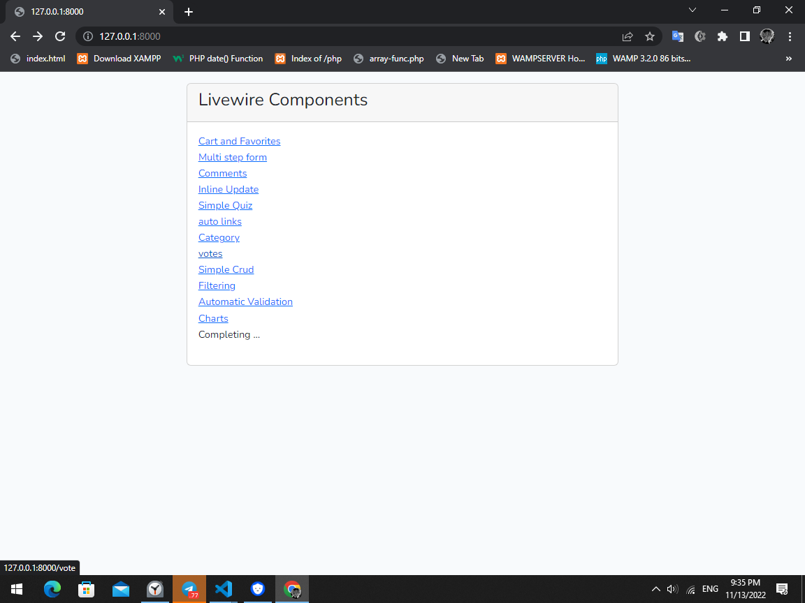

# Livewire Components
## About Project
This is projects that have Components of a website like cart, inlineupdates, comments and etc.
<br>
i create this project by laravel , livewire and alphine.js.

**Note:** if you like it then give me start <br>
**Warning:** Project isn't complete yet.

# installation

- First download project.
- Create database and set name to 'project'
- open your terminal in path of project and type :
````
php artisan migrate --seed
````
- open another terminal and type :
````
php artisan serve
````
- now we need another terminal for compile our file so open another one and type :
````
npm run dev
````
# version
- laravel 9.38.0
- php 8.1
- mysql 8.0.31

# Some Pic



# Developers
<a href="https://github.com/arxia-dev" target="_blank">Arxia</a>

